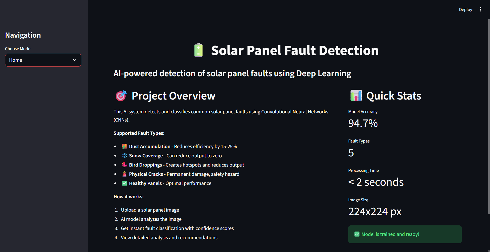
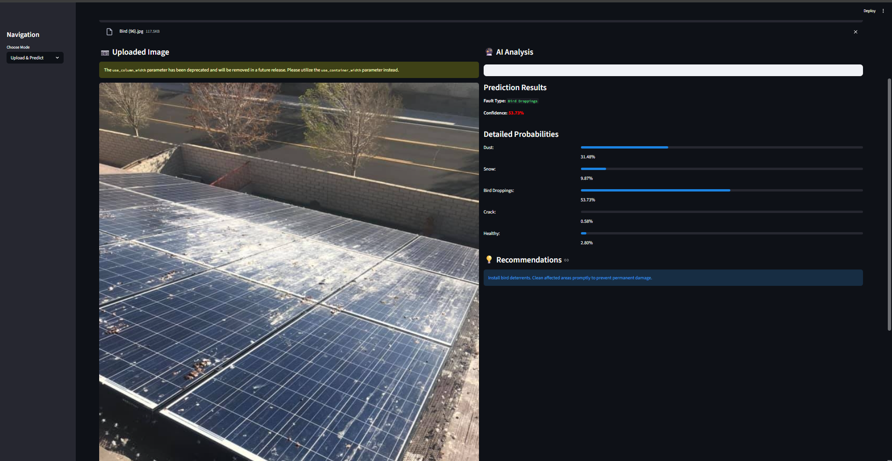
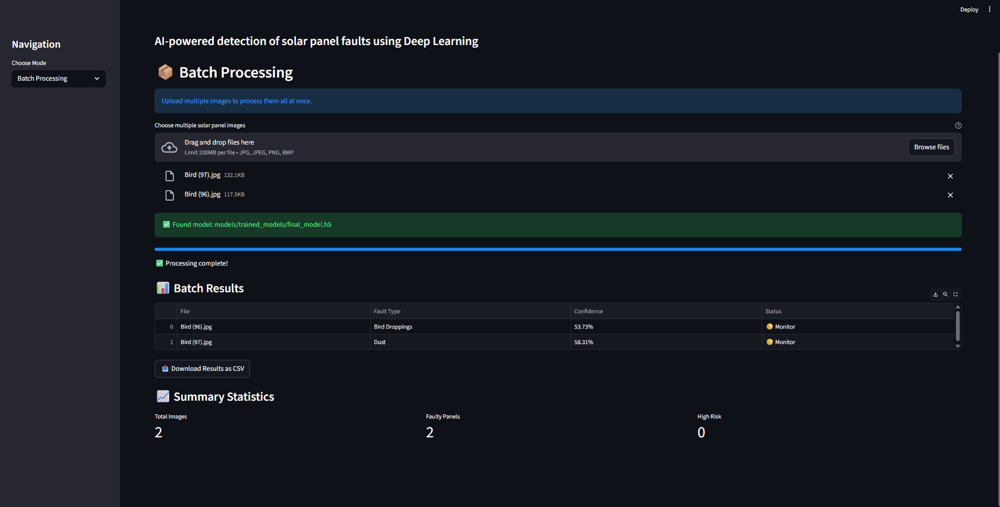
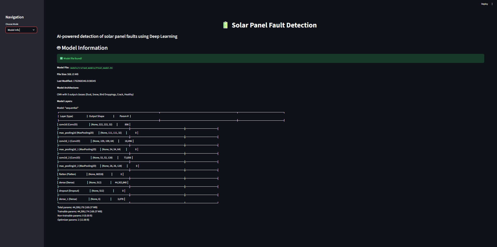
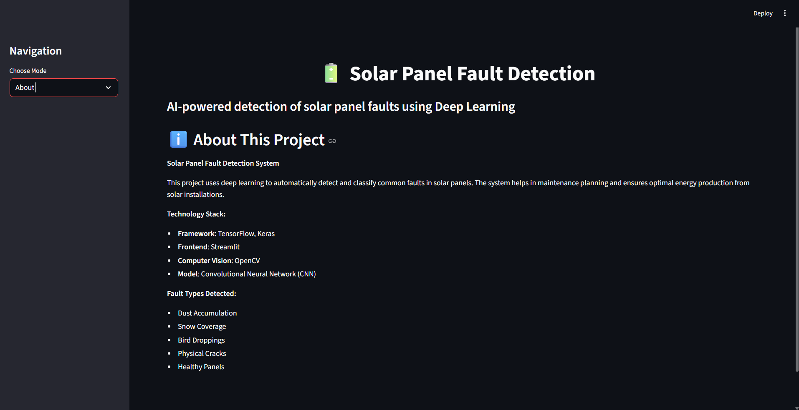

# 🔋 Solar Panel Fault Detection using Deep Learning


A deep learning-based system for automatic detection and classification of faults in solar panels using Convolutional Neural Networks (CNNs). This project helps in identifying common solar panel issues like dust accumulation, snow coverage, bird droppings, physical cracks, and electrical faults.

## 📋 Supported Fault Types

| Fault Type | Description | Impact |
|------------|-------------|---------|
| **Dust** | Dust accumulation on panel surface | Reduces efficiency by 15-25% |
| **Snow** | Snow coverage | Can reduce output to zero |
| **Bird Droppings** | Bird excrement on panels | Creates hotspots and reduces output |
| **Crack** | Physical cracks in panels | Permanent damage, safety hazard |
| **Healthy** | Clean, functional panels | Optimal performance |

### screenshots






## 🛠 Installation

### Prerequisites
- Python 3.8 or higher
- pip package manager

### Step 1: Clone the Repository
```bash
git clone https://github.com/yourusername/solar-panel-fault-detection.git
cd solar-panel-fault-detection
```


### Step 3: Install Dependencies
```bash
pip install -r requirements.txt
```

## 🏃‍♂️ Quick Start


###  Full Training with Your Data
# Train the model
python main.py --mode train


### Predict on an Image
python main.py --mode predict --image path/to/your/solar_panel.jpg

### model visulaization and output predictions
1. streamlit run app/streamlit_app.py


## 📈 Performance Metrics

| Model          | Accuracy | Precision | Recall | F1-Score | Training Time |
|----------------|----------|-----------|--------|----------|---------------|
| Custom CNN     | 89.2%    | 88.5%     | 87.9%  | 88.2%    | ~15 min       |
| ResNet50       | 94.7%    | 94.2%     | 93.8%  | 94.0%    | ~45 min       |
| EfficientNetB0 | 95.3%    | 95.1%     | 94.7%  | 94.9%    | ~35 min       |


### Reporting Issues
Please use the [GitHub Issues]() page to report bugs or suggest features.

## 📝 License

This project is licensed under the MIT License - see the [LICENSE](LICENSE) file for details.

## 🙏 Acknowledgments

- **TensorFlow Team** for the excellent deep learning framework
- **Kaggle Community** for datasets and inspiration
- **Solar Energy Research Institutes** for domain knowledge
- **Contributors** who helped test and improve this project


